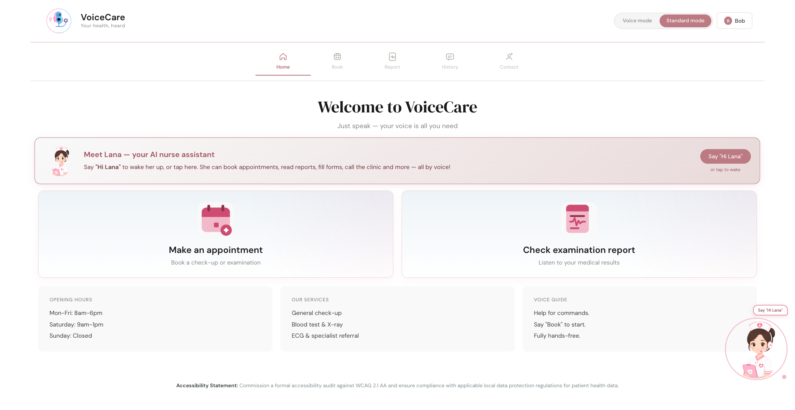
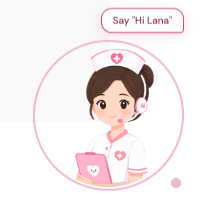
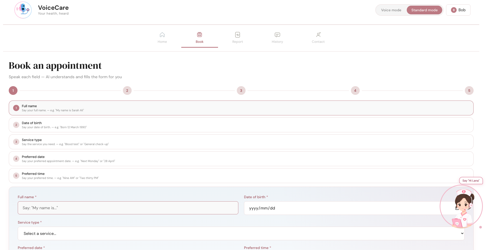
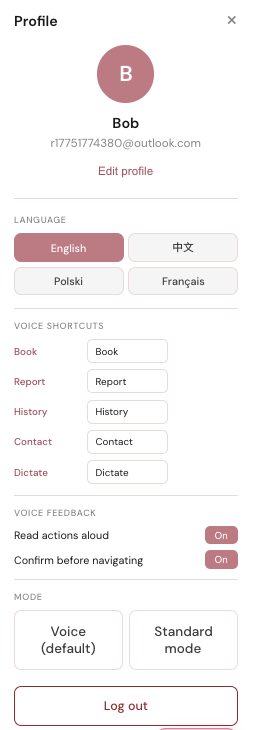
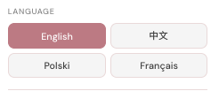

# VoiceCare — AI-Powered Voice Healthcare Assistant

VoiceCare is an AI-enhanced healthcare web platform designed to support accessible, voice-first patient interaction. The system combines conversational AI, multilingual interaction, and healthcare workflow design to simplify appointment booking, medical information access, and patient communication.

The core experience is powered by **Lana**, an embedded AI nurse assistant that helps users navigate the platform through natural voice or text interaction.

---
## Screenshots

### Home Interface



---

### AI Voice Assistant



---

### Appointment Booking


---

### Profile Management



---

### Multilingual Support



## Product Vision

VoiceCare aims to reduce interaction barriers in healthcare environments by combining:

- Voice interaction
- Conversational AI assistance
- Accessibility-first UX design
- Multilingual communication
- Lightweight patient workflow automation

The platform is designed for:

- Elderly users
- International patients
- Users with temporary or permanent accessibility needs
- Low digital literacy users

---

## AI Features

### AI Nurse Assistant — Lana

Lana provides real-time conversational support for healthcare tasks:

- Voice wake-up activation ("Hi Lana")
- Natural language command recognition
- Appointment workflow guidance
- Page navigation assistance
- Healthcare task clarification
- Speech synthesis feedback
- Multi-language voice interaction

Example commands:

```text
"Book appointment"
"Check my report"
"Show my history"
"Call clinic"
```

---

## Core Features

### Patient Features

- AI-guided appointment booking
- Medical report access
- Appointment history tracking
- Contact and support messaging
- Profile management
- Voice and standard interaction modes

### Accessibility Features

- Voice-first navigation
- Adjustable interaction modes
- Large touch targets
- Reduced cognitive load interface
- Immediate system feedback
- Multilingual support

Supported languages:

- English
- Chinese
- Polish
- French

---

## Technical Architecture

### Frontend

- HTML5
- CSS3
- Vanilla JavaScript
- Web Speech API
- Speech Synthesis API
- LocalStorage persistence

### Backend

- :contentReference[oaicite:0]{index=0}
- :contentReference[oaicite:1]{index=1}
- REST API architecture
- JSON-based lightweight persistence

---

## System Modules

```text
VoiceCare
├── Authentication Module
├── AI Assistant Module (Lana)
├── Booking Module
├── Report Module
├── History Module
├── Contact Module
├── Localization Module
└── Profile & Settings Module
```

---

## HCI Design Focus

This project applies Human-Computer Interaction principles:

- Accessibility-first interaction
- Error prevention
- Immediate feedback
- Progressive disclosure
- Reduced memory load
- Voice interaction design

---

## Current Development Stage

Current status:

**MVP + Interactive Prototype + Functional Full-Stack Architecture**

Implemented:

- Multi-page healthcare UI
- Voice interaction engine
- AI assistant behavior
- Profile system
- Localization system
- Backend API integration

---

## Planned Enhancements

### AI

- Context memory for Lana
- Personalized patient recommendations
- Emotion-aware voice feedback
- LLM-powered healthcare intent detection

### Engineering

- JWT authentication
- :contentReference[oaicite:2]{index=2} integration
- Cloud deployment
- API documentation
- Unit testing

---

## Author

Yuting Chen  
MSc in Human-Computer Interaction  
Lodz University of Technology